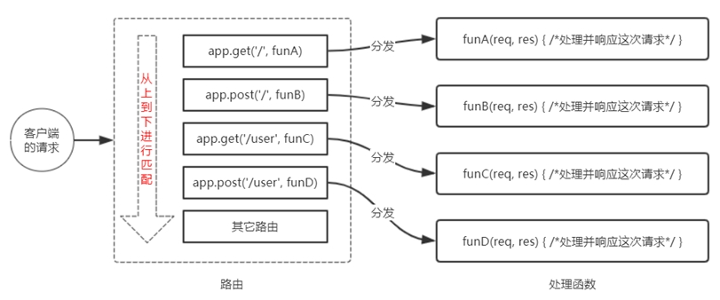
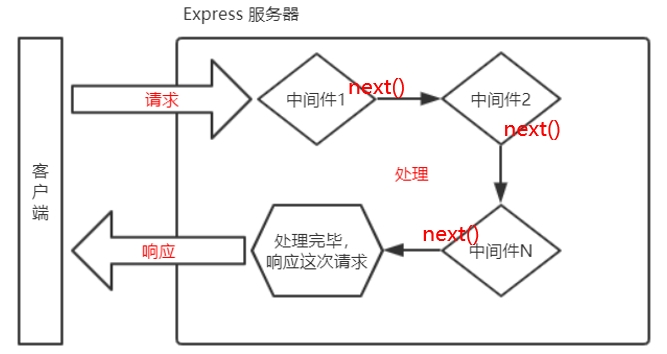

## 简介

Express 是基于 Node.js 平台，快速、开放、极简的 Web 开发框架

通俗的理解：Express 的作用和 Node.js 内置的 http 模块类似，是专门用来创建 Web 服务器的。

本质就是一个 npm 上的第三方包，提供了快速创建 Web 服务器的便捷方法

中文官网 http://www.expressjs.com.cn/

> 不使用 Express 能否创建 Web 服务器？
> 能，使用 Node.js 提供的原生 http 模块即可
> 有了 http 内置模块，为什么还有用 Express？
> http 内置模块用起来很复杂，开发效率低；
> Express 是基于内置的 http 模块进一步封装出来的，能够极大的提高开发效率
> http 内置模块与 Express 是什么关系？
> 类似于浏览器中 Web API 和 jQuery 的关系。后者是基于前者进一步封装出来的

对于前端程序员来说，最常见的两种服务器，分别是

Web 网站服务器：专门对外提供 Web 网页资源的服务器

API 接口服务器：专门对外提供 API 接口的服务器

使用 Express，我们可以方便、快速的**创建 Web 网站的服务器或 API 接口的服务器**

### Express 的基本使用

1. 在项目所处的目录中安装

   ```bash
   npm i express@4.17.1
   ```

2. 创建基本的 Web 服务器

   ```javascript
   const express = require('express);	// 导入express
                           
   const app = express();							// 创建web服务器
   
   app.listen(80, () => {							// 调用回调函数，listen() 启动服务器
   	console.log(''express server running at http://127.0.0.1)
   });
   ```

3. 处理请求

   ```javascript
   // 监听 GET 请求
   app.get('url', function(req, res) { /*处理函数*/ })
   
   // 监听 POST 请求
   app.post('url', function(req, res) { /*处理函数*/ })
   
   app.post('url', function(req, res) {
     // 通过 req.query 对象，可以访问到客户端通过查询字符串的形式，发送到服务器的参数
     console.log(req.query)
     
     // 通过 req.params 对象，可以访问到 URL 中，通过 : 匹配到的动态参数
     console.log(req.parms)
     
     // 通过 res.send()方法，把处理好的内容发送给客户端
     res.send(data);
   })
   
   
   ```

   ```javascript
   // 1. 导入 express
   const express = require('express')
   // 2. 创建 web 服务器
   const app = express()
   
   // 4. 监听客户端的 GET 和 POST 请求，并向客户端响应具体的内容
   app.get('/user', (req, res) => {
     // 调用 express 提供的 res.send() 方法，向客户端响应一个  JSON 对象
     res.send({ name: 'zs', age: 20, gender: '男' })
   })
   app.post('/user', (req, res) => {
     // 调用 express 提供的 res.send() 方法，向客户端响应一个  文本字符串
     res.send('请求成功')
   })
   app.get('/', (req, res) => { 
     // 通过 req.query 可以获取到客户端发送过来的 查询参数 ‘/’表示ip根目录
     // 注意：默认情况下，req.query 是一个空对象
     console.log(req.query)
     res.send(req.query)
   })
   
   
   // 注意：这里的 :id 是一个动态的参数
   app.get('/user/:id/:username', (req, res) => {
     // req.params 是动态匹配到的 URL 参数，默认也是一个空对象
     console.log(req.params)
     res.send(req.params)
   })
   
   // 3. 启动 web 服务器
   app.listen(80, () => {
     console.log('express server running at http://127.0.0.1')
   })
   
   ```

**注意： :id 是一个动态的参数，‘：’是固定的写法，可以有多个参数，其中id 是该参数名字，而req.params可以动态匹配该参数的值。**

### 托管静态资源

express 提供了一个非常好用的函数，叫做 express.static()，通过它，我们可以非常方便地创建一个静态资源服务器，例如，通过如下代码就可以将 public 目录下的图片、CSS 文件、JavaScript 文件对外开放访问了

```javascript
app.use(express.static('public'))
```

 现在，你就可以访问 public 目录中的所有文件了
 http://localhost/images/bg.jpg
 http://localhost/css/style.css
 http://localhost/js/login.js

注意：Express 在指定的静态目录中查找文件，对外提供资源访问路径，目录名不会出现在 URL 中

#### **托管多个静态资源目录**

访问静态资源文件时，express.static() 函数会根据目录的添加顺序查找所需的文件，如下同名先访问public文件夹

```javascript
app.use(express.static('public'))
app.use(express.static('files'))
```

#### **挂载路径前缀**

如果希望在托管的静态资源访问路径之前，挂载路径前缀，则可以使用如下的方式

```javascript
app.use('/public', express.static('public'))
```

 现在，你就可以通过带有 /public 前缀地址来访问 public 目录中的文件了
 http://localhost:3000/public/images/kitten.jpg
 http://localhost:3000/public/css/style.css
 http://localhost:3000/public/js/app.js

```javascript
const express = require('express')
const app = express()

// 在这里，调用 express.static() 方法，快速的对外提供静态资源
app.use('/files', express.static('./files'))
app.use(express.static('./clock'))

app.listen(80, () => {
  console.log('express server running at http://127.0.0.1')
})
```

### nodemon

在编写调试 Node.js 项目的时候，如果修改了项目的代码，需要频繁的手动重新启动服务，使用 [nodemon](https://www.npmjs.com/package/nodemon)  工具，它能够监听项目文件的变动，当代码被修改后，nodemon 会自动重启项目，极大方便了开发和调试。

```bash
npm i -g nodemon
```

现在，我们可以将 node 命令替换为 **nodemon** 命令，使用 nodemon app.js 来启动项目。

```bash
nodemon app.js
```

## 路由

广义上来讲，路由就是映射关系

在 Express 中，路由指的是客户端的请求与服务器处理函数之间的映射关系

### 路由的组成

Express 中的路由分 3 部分组成，分别是请求的类型、请求的 URL 地址、处理函数，格式如下

```javascript
app.method(path, handler())	// method 具体为 get post 等
```


### 路由的匹配过程

- 每当一个请求到达服务器之后，需要先经过路由的匹配，只有匹配成功之后，才会调用对应的处理函数。

- 在匹配时，会按照路由的顺序进行匹配，如果请求类型和请求的 URL 同时匹配成功，则 Express 会将这次请求，转交给对应的 function 函数进行处理。

    

- 注意

    1. 按照定义的先后顺序进行匹配

    1. 请求类型和请求的URL同时匹配成功，才会调用对应的处理函数


### 路由的使用

在 Express 中使用路由最简单的方式，就是把路由挂载到 app 上，示例代码：

```javascript
const express = require('express')

const app = express()

// 挂载路由
app.get('/', (req, res) => {res.send('hello world.')})
app.post('/', (req, res) => {res.send('Post Request.')})

app.listen(80, () => {console.log('express server running at http://127.0.0.1')})
```


### 模块化路由

为了方便对路由进行模块化的管理，Express 不建议将路由直接挂载到 app 上，而是推荐将路由抽离为单独的模块。将路由抽离为单独模块的步骤如下

- 创建路由模块对应的 .js 文件
- 调用 express.Router() 函数创建路由对象
- 向路由对象上挂载具体的路由
- 使用 module.exports 向外共享路由对象
- 使用 app.use() 函数注册路由模块

```javascript
// 路由模块 router.js

const express = require('express')	// 1. 导入 express
const router = express.Router()			// 2. 创建路由对象

// 3. 挂载具体的路由
router.get('/user/list', (req, res) => {res.send('Get user list.')})
router.post('/user/add', (req, res) => {res.send('Add new user.')})

// 4. 向外导出路由对象
module.exports = router
```

```javascript
// app.js

const express = require('express')
const router = require('./router')	// 1. 导入路由模块

const app = express()

// 注意： app.use() 函数的作用，就是来注册全局中间件
// app.use('/files', express.static('./files'))
app.use('/api', router)	// 2. 注册路由模块，若想使用静态资源一样可以加统一的访问前缀

app.listen(80, () => {console.log('http://127.0.0.1')})
```


## 中间件

### 简介

**中间件**（Middleware ），特指业务流程的中间处理环节

Express 中间件的调用流程

- 当一个请求到达 Express 的服务器之后，可以连续调用多个中间件，从而对这次请求进行预处理

    

### **中间件的格式**

- Express 的中间件，本质上就是一个 **function 处理函数**，Express 中间件的格式如下
- 注意：中间件函数的形参列表中，必须包含 **next 参数**，而路由处理函数中只包含 req 和 res


### **next 函数的作用**

- next 函数是实现多个中间件连续调用的关键，它表示把流转关系**转交**给下一个中间件或路由



### 中间件初体验

全局生效的中间件：是客户端发起的任何请求，达到服务器之后，都会触发的中间件

- 通过**app.use(中间件函数)**，即可定义一个全局生效的中间件

```javascript
const express = require('express')
const app = express()

// 定义一个最简单的中间件函数
//mw指向的就是一个中间件函数
const mw = function (req, res, next) {
  console.log('这是最简单的中间件函数')
  // 把流转关系，转交给下一个中间件或路由
  next()
}

// 将 mw 注册为全局生效的中间件
app.use(mw)

// 这是定义全局中间件的简化形式
// app.use((req, res, next) => {
//   console.log('这是最简单的中间件函数')
//   next()
// })

app.get('/', (req, res) => {
  console.log('调用了 / 这个路由')
  res.send('Home page.')
})
app.get('/user', (req, res) => {
  console.log('调用了 /user 这个路由')
  res.send('User page.')
})

app.listen(80, () => {
  console.log('http://127.0.0.1')
})
```

### **中间件的作用**

- 多个中间件之间，共享同一份 req和 res。基于这样的特性，我们可以在上游的中间件中，统一为 req 或 res 对象添加自定义的属性或方法，供下游的中间件或路由进行使用

```javascript
const express = require('express')
const app = express()

//定义全局中间件的简化形式
app.use((req, res, next) => {
  const time = Date.now()	// 获取到请求到达服务器的时间
  req.startTime = time	
    // 为 req 对象，挂载自定义属性，从而把时间共享给后面的所有路由！！！！！！！！！！
  next()
})

app.get('/', (req, res) => {res.send('Home page.' + req.startTime)})
app.get('/user', (req, res) => {res.send('User page.' + req.startTime)})

app.listen(80, () => {console.log('http://127.0.0.1')})
```

**定义多个全局中间件**，按照顺序先后调用

```javascript
const express = require('express')
const app = express()

// 定义第一个全局中间件
app.use((req, res, next) => {
  console.log('调用了第1个全局中间件')
  next()
})
// 定义第二个全局中间件
app.use((req, res, next) => {
  console.log('调用了第2个全局中间件')
  next()
})

app.get('/user', (req, res) => {res.send('User page.')})

app.listen(80, () => {console.log('http://127.0.0.1')})
```

**局部生效的中间件**：**不使用 app.use() 定义的中间件**叫做局部生效的中间件

**定义多个局部中间件**

```javascript
const express = require('express')

const app = express()

// 1. 定义中间件函数
const mw1 = (req, res, next) => {
  console.log('调用了局部生效的中间件')
  next()
}

const mw2 = (req, res, next) => {
  console.log('调用了第二个局部生效的中间件')
  next()
}

// 2. 创建路由，可见mw1，mw2只会在对应有调用的中间件中生效，调用：在get中的url和method中加一个/多个参数
//以下两种方式等价
app.get('/', mw1, nw2, (req, res) => {res.send('Home page.')})
app.get('/user', [mw1, mw2],(req, res) => {res.send('User page.')})

app.listen(80, function () {console.log('Express server running at http://127.0.0.1')})
```

**中间件的5个使用注意事项**

1. 一定要在路由之前注册中间件，如果直接匹配到路由就会直接响应了。
2. 客户端发送过来的请求，可以连续调用多个中间件进行处理
3. 执行完中间件的业务代码之后，不要忘记调用 next() 函数
4. 为了防止代码逻辑混乱，调用 next() 函数后不要再写额外的代码
5. 连续调用多个中间件时，多个中间件之间，共享req 和 res 对象


### 中间件的分类

为了方便大家理解和记忆中间件的使用，Express 官方把常见的中间件用法，分成了 5 大类

- 应用级别的中间件
- 路由级别的中间件
- 错误级别的中间件
- Express 内置的中间件
- 第三方的中间件

#### 应用级别的中间件

通过 **app.use() 或 app.get() 或 app.post() ，绑定到 app 实例上的中间件**，叫做应用级别的中间件

#### **路由级别的中间件**

绑定到 **express.Router()** 实例上的中间件，叫做路由级别的中间件。它的用法和应用级别中间件没有任何区别。只不过，应用级别中间件是绑定到 app 实例上，路由级别中间件绑定到 router 实例上

```javascript
const express = require('express')
const router = express.Router()

// 路由级别的中间件
router.use((req, res, next)=>{
  console.log('Time:' + Date.now())
	next()
})

module.experts = router
```

#### **错误级别的中间件**

错误级别中间件的作用：专门用来捕获整个项目中发生的异常错误，从而防止项目异常崩溃的问题。

格式：错误级别中间件的 function 处理函数中，必须有 4 个形参，形参顺序从前到后，分别是 (**err**, req, res, next)。

**注意：错误级别的中间件，必须注册在所有路由之后！**

```javascript
const express = require('express')
const app = express()

// 1. 定义路由
app.get('/', (req, res) => {
  // 1.人为的制造错误
  throw new Error('服务器内部发生了错误！')
  res.send('Home page.')
})

// 2. 定义错误级别的中间件，捕获整个项目的异常错误，从而防止程序的崩溃
app.use((err, req, res, next) => {
  console.log('发生了错误！' + err.message)
  res.send('Error：' + err.message)
})

app.listen(80, function () {console.log('Express server running at http://127.0.0.1')})
```


#### **Express内置的中间件**

自 Express 4.16.0 版本开始，Express 内置了 3 个常用的中间件，极大提高了 Express 项目的开发效率和体验

- express.static() 快速托管静态资源的内置中间件，例如： HTML 文件、图片、CSS 样式等（无兼容性，任何版本都能用）
- express.json() 解析 JSON 格式的请求体数据（有兼容性，仅在 4.16.0+ 版本中可用）
- express.urlencoded(option) 解析 URL-encoded 格式的请求体数据（有兼容性，仅在 4.16.0+ 版本中可用）

```javascript
const express = require('express')
const app = express()

// 通过 express.json() 这个中间件，解析表单中的 JSON 格式的数据
app.use(express.json())

// 通过 express.urlencoded() 这个中间件，来解析 表单中的 url-encoded 格式的数据
app.use(express.urlencoded({ extended: false }))

app.post('/user', (req, res) => {
  // 在服务器端，可以通过 req.body 来获取 JSON 格式的表单数据和 url-encoded 格式的请求体数据
  // 默认情况下，如果不配置解析表单数据的中间件，则 req.body 默认等于 undefined
  console.log(req.body)
  res.send('ok')
})

app.post('/book', (req, res) => {
  console.log(req.body)
  res.send('ok')
})

// 调用 app.listen 方法，指定端口号并启动web服务器
app.listen(80, function () {
  console.log('Express server running at http://127.0.0.1')
})
```


#### **第三方的中间件**

非 Express 官方内置的，由第三方开发出来的中间件。项目中，可以按需下载并配置第三方中间件，从而提高项目的开发效率

- 如：在 express@4.16.0 之前的版本中，经常使用 **body-parser** 这个第三方中间件，来解析请求体数据。使用步骤如下
    - 运行 **npm install body-parser**安装中间件
    - 使用 **require**导入中间件
    - 调用 **app.use()** 注册并使用中间件

- 注意：Express 内置的 **express.urlencoded**，就是基于 body-parser 这个第三方中间件进一步封装出来的

```javascript
const express = require('express')
const app = express()

// 1. 导入解析表单数据的中间件 body-parser
const parser = require('body-parser')
// 2. 使用 app.use() 注册中间件
app.use(parser.urlencoded({ extended: false }))
// app.use(express.urlencoded({ extended: false }))

app.post('/user', (req, res) => {
  // 如果没有配置任何解析表单数据的中间件，则 req.body 默认等于 undefined
  console.log(req.body)
  res.send('ok')
})

app.listen(80, function () {console.log('Express server running at http://127.0.0.1')})
```


### 自定义中间件

自己手动模拟一个类似于 express.urlencoded这样的中间件，来解析 POST 提交到服务器的表单数据，实现步骤：

1. 定义中间件

2. 监听 req 的 data 事件

    来获取客户端发送到服务器的数据。如果数据量比较大，无法一次性发送完毕，则客户端会把数据切割后，分批发送到服务器。所以 data 事件可能会触发多次，每一次触发 data 事件时，获取到数据只是完整数据的一部分，需要手动对接收到的数据进行拼接。

3. 监听 req 的 end 事件

    当请求体数据接收完毕之后，会自动触发 req 的 end 事件，可以在 req 的 end 事件中，拿到并处理完整的请求体数据

    Node.js 内置了一个 querystring 模块，专门用来处理查询字符串。通过这个模块提供的 parse() 函数，可以轻松把查询字符串，解析成对象的格式

4. 使用 querystring模块解析请求体数据
5. 将解析出来的数据对象挂载为 req.body
6. 将自定义中间件封装为模块

```javascript
// custom-body-parser.js

const qs = require('querystring')	// 导入 Node.js 内置的 querystring 模块

const bodyParser = (req, res, next) => {
  // 定义中间件具体的业务逻辑
  // 1. 定义一个 str 字符串，专门用来存储客户端发送过来的请求体数据
  let str = ''
  // 2. 监听 req 的 data 事件，str 中存放的是完整的请求体数据
  req.on('data', (chunk) => {
    str += chunk
  })
  // 3. 监听 req 的 end 事件（请求体发送完毕后自动触发）
  req.on('end', () => {
    req.body = qs.parse(str)	// 把字符串格式的请求体数据，解析成对象格式，不解析的话是 name=zs&gender=%6Eksskk
      //将解析出来的数据挂载在req.body上，供下游中间件访问
    next()
  })
}

module.exports = bodyParser
```

```javascript
const express = require('express')
const app = express()

// 导入自己封装的中间件模块，将自定义的中间件函数，注册为全局可用的中间件
app.use(require('./custom-body-parser'))

app.post('/user', (req, res) => {
  res.send(req.body)
})

// 调用 app.listen 方法，指定端口号并启动web服务器
app.listen(80, function () {
  console.log('Express server running at http://127.0.0.1')
})
```


## 使用 Express 写接口

浏览器从一个域名的网页去请求另一个域名的资源时，域名、端口、协议任一不同，都是跨域

### 接口的跨域问题

刚才编写的 GET 和 POST接口，存在一个很严重的问题：不支持跨域请求，解决接口跨域问题的方案主要有两种

- 通过配置响应头来解决
- CORS（主流解决方案，推荐）
- JSONP（有缺陷：只支持 GET 请求）

#### 响应头

响应头部可以携带一个Access-Control-Allow-Origin字段，语法如下：

1. **Access-Control-Allow-Origin: 或 ***

Origin指定了允许访问该资源的外域 URL，可以控制哪些网页可以请求该服务器，而*表示所有网页均可

```javascript
res.setHeader('Access-Control-Allow-Origin', 'http....')
```

2. **Access-Control-Allow-Headers** ：

默认情况下，CORS 仅支持客户端向服务器发送如下的 9 个请求头

`Accept、Accept-Language、Content-Language、DPR、Downlink、Save-Data、Viewport-Width、Width 、Content-Type （值仅限于 text/plain、multipart/form-data、application/x-www-form-urlencoded）`

如果客户端向服务器发送了额外的请求头信息，则需要在服务器端，通过 Access-Control-Allow-Headers 对额外的请求头进行声明，否则这次请求会失败！

```javascript
res.setHeader('Access-Control-Allow-Headers', 'Content-Type, X-custom-Header')
```

3. **Access-Control-Allow-Methods**：（更多的请求方式）

默认情况下，CORS 仅支持客户端发起 GET、POST、HEAD 请求。

如果客户端希望通过 PUT、DELETE 等方式请求服务器的资源，则需要在服务器端，通过 Access-Control-Alow-Methods来指明实际请求所允许使用的 HTTP 方法

```javascript
res.setHeader('Access-Control-Allow-Methods', 'POST, GET, PUT, DELETE')

res.setHeader('Access-Control-Allow-Methods', '*')	// 支持所有请求
```

#### 使用 CORS 中间件解决跨域问题

CORS（Cross-Origin Resource Sharing，跨域资源共享）是 Express 的一个第三方中间件，由一系列 HTTP 响应头组成，这些 **HTTP 响应头决定浏览器是否阻止前端 JS 代码跨域获取资源**。可以很方便地解决跨域问题。

##### 使用步骤

1. 运行 `npm install cors` 安装中间件
2. 使用 `const cors = require(‘cors’)` 导入中间件
3. 在路由之前调用 `app.use(cors())` 配置中间件

```javascript
const express = require('express');
const cors = require('cors');

const app = express();

// 启用 CORS 中间件
app.use(cors());

// 其他路由和中间件定义
// ...

// 启动服务器
app.listen(3000, () => {
  console.log('服务器已启动在端口 3000');
});
```

也可以配置`cors`中间件的选项来更精细地控制跨域访问的行为，例如只允许特定的域名或请求头。以下是一个示例：

```javascript
const corsOptions = {
  origin: 'http://example.com', // 允许的来源域名
  methods: 'GET,HEAD,PUT,PATCH,POST,DELETE', // 允许的HTTP方法
  credentials: true, // 允许发送凭证（例如，cookies）
  optionsSuccessStatus: 204, // 选项预检请求成功的HTTP状态码
};

app.use(cors(corsOptions));
```

注意点：

- CORS 在**服务器端**进行配置，客户端浏览器无须做任何额外的配置，即可请求开启了 CORS 的接口。
- CORS 在浏览器中有**兼容性**，只有支持 XMLHttpRequest Level2 的浏览器，才能正常访问开启了 CORS 的服务端接口（如：IE10+、Chrome4+、FireFox3.5+）

##### CROS请求分类

客户端在请求 CORS 接口时，根据请求方式和请求头的不同，可以将 CORS 的请求分为两大类：

- 简单请求
    - 同时满足以下两大条件的请求，就属于简单请求
        请求方式：GET、POST、HEAD 三者之一
    - HTTP 头部信息不超过以下几种字段：无自定义头部字段、Accept、Accept-Language、Content-Language、DPR、Downlink、Save-Data、Viewport-Width、Width 、Content-Type（只有三个值application/x-www-form-urlencoded、multipart/form-data、text/plain）

- 预检请求
    - 只要符合以下任何一个条件的请求，都需要进行预检请求
        - ⅰ请求方式为 GET、POST、HEAD 之外的请求 Method 类型
        - ⅱ请求头中包含自定义头部字段
        - ⅲ向服务器发送了 application/json 格式的数据
    - 在浏览器与服务器正式通信之前，浏览器会先发送 OPTION 请求进行预检，以获知服务器是否允许该实际请求，这一次的 OPTION 请求称为预检请求。服务器成功响应预检请求后，才会发送真正的请求，并且携带真实数据。

简单请求的特点：客户端与服务器之间只**会发生一次请求**
预检请求的特点：客户端与服务器之间会发生两次请求，**OPTION 预检请求成功之后，才会发起真正的请求**


#### JSONP 接口（有缺陷只支持GET）

- 概念：浏览器端通过`<script>`标签的 `src` 属性，请求服务器上的数据，同时，服务器返回一个函数的调用。这种请求数据的方式叫做JSONP
- **特点:**`JSONP`不属于真正的`Ajax`请求，因为它没有使用`XMLHttpRequest`这个对象，`JSONP`仅支持`GET`请求，不支持`POST、PUT、DELETE`等请求

**实现 JSONP 接口的步骤**：

1. 获取客户端发送过来的**回调函数的名字**
2. 得到要通过 JSONP 形式发送给客户端的数据
3. 根据前两步得到的数据，**拼接出一个函数调用的字符串**
4. 把上一步拼接得到的字符串，**响应给客户端的**

```javascript
const express = require('express')

const app = express()

// 配置解析表单数据的中间件
app.use(express.urlencoded({ extended: false }))

// 必须在配置 cors 中间件之前，配置 JSONP 的接口
app.get('/api/jsonp', (req, res) => {
  // 定义 JSONP 接口具体的实现过程
  const funcName = req.query.callback	// 1. 得到函数的名称
  const data = { name: 'zs', age: 22 }	// 2. 定义要发送到客户端的数据对象
  const scriptStr = `${funcName}(${JSON.stringify(data)})`	// 3. 拼接出一个函数的调用
  res.send(scriptStr)		// 4. 把拼接的字符串，响应给客户端
})

// 一定要在路由之前，配置 cors 这个中间件，从而解决接口跨域的问题
const cors = require('cors')
app.use(cors())

// 导入路由模块
const router = require('./16.apiRouter')
// 把路由模块，注册到 app 上
app.use('/api', router)

app.listen(80, () => {console.log('express server running at http://127.0.0.1')})
```

测试模块

```javascript
<!DOCTYPE html>
<html lang="en">
  <head>
    <meta charset="UTF-8" />
    <meta name="viewport" content="width=device-width, initial-scale=1.0" />
    <title>Document</title>
    <script src="https://cdn.staticfile.org/jquery/3.4.1/jquery.min.js"></script>
  </head>
  <body>
    <button id="btnGET">GET</button>
    <button id="btnPOST">POST</button>
    <button id="btnDelete">DELETE</button>
    <button id="btnJSONP">JSONP</button>

    <script>
      $(function () {
        // 1. 测试GET接口
        $('#btnGET').on('click', function () {
          $.ajax({
            type: 'GET',
            url: 'http://127.0.0.1/api/get',
            data: { name: 'cess', age: 18 },
            success: function (res) {
              console.log(res)
            },
          })
        })
        // 2. 测试POST接口
        $('#btnPOST').on('click', function () {
          $.ajax({
            type: 'POST',
            url: 'http://127.0.0.1/api/post',
            data: { bookname: '开端', author: '祈祷君' },
            success: function (res) {
              console.log(res)
            },
          })
        })

        // 3. 为删除按钮绑定点击事件处理函数
        $('#btnDelete').on('click', function () {
          $.ajax({
            type: 'DELETE',
            url: 'http://127.0.0.1/api/delete',
            success: function (res) {
              console.log(res)
            },
          })
        })

        // 4. 为 JSONP 按钮绑定点击事件处理函数
        $('#btnJSONP').on('click', function () {
          $.ajax({
            type: 'GET',
            url: 'http://127.0.0.1/api/jsonp',
            dataType: 'jsonp',
            success: function (res) {
              console.log(res)
            },
          })
        })
      })
    </script>
  </body>
</html>

```


## 参考资料

<https://blog.csdn.net/m0_52316372/article/details/124759186>

<https://blog.csdn.net/m0_52316372/article/details/124759435?spm=1001.2014.3001.5502>