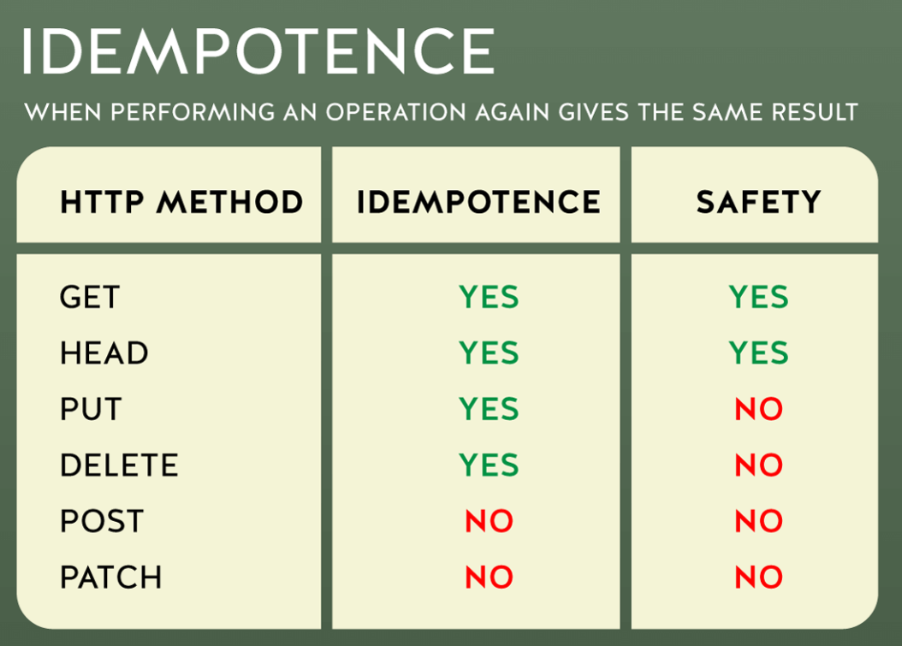

## Application 常用属性和方法

> app.all(path, callback [, callback ...])

这个方法类似于标准的app.METHOD()方法，只不过它匹配所有HTTP请求。

```javascript
app.all('/secret', function (req, res, next) {
  console.log('Accessing the secret section ...')
  next() // pass control to the next handler
})

app.all('/*', function (req, res, next) {
  console.log('Accessing the secret section ...')
  next() // pass control to the next handler
})
```


> app.use([path,] callback [, callback...])

在指定的路径上挂载指定的中间件函数:当请求的路径的基数与path匹配时，中间件函数将执行。

``` javascript
app.use(function (req, res, next) {
  console.log('Time: %d', Date.now())
  next()
})

app.use('/abcd', function (req, res, next) {
  next()
})
```


> app.delete(path, callback [, callback ...])
>
> app.get(path, callback [, callback ...])
>
> app.post(path, callback [, callback ...])
>
> app.put(path, callback [, callback ...])


幂等性（idempotent、idempotence）：幂等是一个数学与计算机学概念，常见于抽象代数中。在编程中一个幂等操作的特点是执行多次或1次，其影响是相同的。

比如： GET：客户端请求多次或1次，对请求的资源产生的影响是相同； DELETE：删除多次或1次，其删除的数据范围都是相同的，影响是相同的; PUT：将A值更新为B值，执行多次其最终结果仍是B值；




RESTful API设计中POST、PUT的使用场景
在开发中如果不遵守RESTful API 的设计规范会把POST的职能由“新增”，扩展到支持“新增、更新、删除”。日常开发中执行CRUD时我们应该遵循以下规则：

| 请求类型 | 描述                 |
| -------- | -------------------- |
| GET      | 读取（幂等）         |
| POST     | 新增                 |
| PUT      | 更新（幂等）         |
| PATCH    | 更新，通常是部分更新 |
| DELETE   | 删除（幂等）         |


使用方式：

```javascript
app.get('/', function (req, res) {
  res.send('GET request to homepage')
})

app.post('/', function (req, res) {
  res.send('Post request to homepage')
})

app.delete('/', function (req, res) {
  res.send('Delete request to homepage')
})

app.put('/', function (req, res) {
  res.send('PUT request to homepage')
})
```


## Request 常用属性和方法

> req.baseUrl 获取基础路径

```javascript
app.get('/hello', function (req, res) {
    console.log(req.baseUrl)
})
```


> req.body 获取body里面的内容

```javascript
var express = require('express')

var app = express()

app.use(express.json()) // for parsing application/json
app.use(express.urlencoded({ extended: true })) // for parsing application/x-www-form-urlencoded

app.post('/profile', function (req, res, next) {
  console.log(req.body)
  res.json(req.body)
})
```


> req.hostname 域名
>
> req.ip 访问ip
>
> req.method 请求的方法
>
> req.originalUrl 原始路径
>
> req.params 获取属性
>
> req.path 获取路径
>
> req.protocol 请求协议
>
> req.query 获取query属性
>
> req.route 当前路由信息

```javascript
var express = require('express')

var app = express()

// 请求路径 /test/hello?test=abc
app.post('/test/:name', function (req, res, next) {
    console.log(req.hostname) // Host: "example.com:3000" =>  example.com
    console.log(req.ip) // 127.0.0.1
    console.log(req.method) // post
    console.log(req.originalUrl) // /test/hello?test=abc
    console.log(req.params.name) // hello
    console.log(req.path) // /test
    console.log(req.protocol) // https://example.com/ => https
    console.log(req.query.test) // abc
    res.send(req.route)
})
```


## Response 常用属性和方法

下载文件 

> res.download(path [, filename][, options] [, fn])

```javascript
res.download('/report-12345.pdf')

res.download('/report-12345.pdf', 'report.pdf')

res.download('/report-12345.pdf', 'report.pdf', function (err) {
  if (err) {
    // Handle error, but keep in mind the response may be partially-sent
    // so check res.headersSent
  } else {
    // decrement a download credit, etc.
  }
})
```


结束响应

> res.end([data][, encoding])

```javascript
res.end()
res.status(404).end()
```


获取相应http头

> res.get(field)

```javascript
res.get('Content-Type')
// => "text/plain"
```


重定向

> res.redirect([status,] path)

```javascript
res.redirect(301, 'http://example.com')
res.redirect('../login')
res.redirect('http://baidu.com')
```


设置响应的HTTP状态。

> res.status(code)

```javascript
res.status(403).end()
res.status(400).send('Bad Request')
res.status(404).sendFile('/absolute/path/to/404.png')
```

