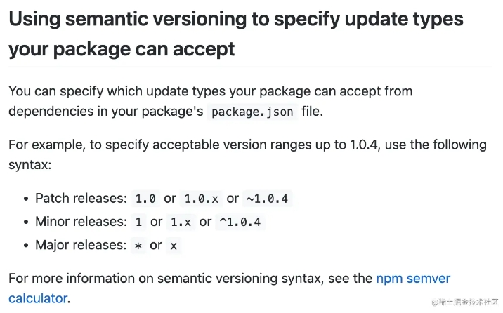

::: tip 前言
在前端工程化的背景下，依赖管理越来越得到重视，在开发的时候经常会接触到各种包管理工具，也会经常用到npm, yarn, pnpm等等指令，这篇文章主要是讲一讲这些概念之间的区别。
:::

## npm

NPM（Node Package Managemnt）为Node创造了一个强大且丰富的生态，是[Node.js](https://link.juejin.cn/?target=https%3A%2F%2Fso.csdn.net%2Fso%2Fsearch%3Fq%3DNode%26spm%3D1001.2101.3001.7020)能够如此成功的主要原因之一。npm也是node.js内置的包管理器，和node一并安装。我们可以从npm的发展历程来看其的特性变化。

### npm v2

特性 ：采用简单的**递归安装**方法，将每个模块的依赖安装到自身的node_modules文件夹中，形成一个**高度嵌套**的依赖树。

可能存在的问题 ：

1. 项目规模比较大时，容易出现重复依赖，互相依赖，嵌套地狱等问题。

2. 大量的重复依赖安装，造成空间资源的大量浪费，同时也会造成依赖安装时间过长（体积大，安装慢）。

3. 由于嵌套层级过深会导致文件路径过长，在windows系统中可能会引发错误。 windows 文件系统中，文件路径不能超过 260 个字符长度。

### npm v3

特性 ：v3版本作了较大的更新，采取了**扁平化**的依赖结构。

可能存在的问题 ：

1. 采取扁平化的结构可以解决上述的问题。但是也会存在新的问题。为了生成扁平化的依赖树，npm需要遍历项目中的所有依赖关系，构建完整的依赖关系树，这是一个比较耗时的操作，所以也会造成依赖安装时间过长。这个是github上npm仓库中的一个[issue](https://link.juejin.cn/?target=https%3A%2F%2Fgithub.com%2Fnpm%2Fnpm%2Fissues%2F8826)对此的描述

> npm@3 is sometimes slower than npm@2, though this is highly tree dependent. It is doing more, but all the same, folks'd like it to be as fast as it can be. Profiling would be grand. ;) This ticket exists as the tracker for npm@3 performance.

### npm v5

特性 ：引入了**package-lock.json**机制，保证了依赖安装的确定性。package-lock.json 的作用是锁定项目的依赖结构，理论上只要项目中存在 package-lock.json 文件，每次执行 npm install 后生成的node_modules 目录结构一定是完全相同的。

其实在package-lock.json机制出现之前，可以通过**npm-shrinkwrap**实现锁定依赖结构，但是npm-shrinkwrap的默认关闭的，需要主动执行。

#### **什么是语义版本控制（semver）？**

在了解为什么要引入锁定依赖结构的机制之前，我们需要了解npm的[语义版本控制（semver）](https://link.juejin.cn/?target=http%3A%2F%2Fsemver.org%2F)。简单来说，npm包的版本描述并不是绝对精确的，而是包含一定语义（可变化）。我们可能会遇到形如这样的版本号。

```bash
"@types/react": "^18.0.12",
```

这里的 **^** 表示指定的 MAJOR 版本号下, 所有更新的版本。这里会安装18.x.x的任意最新版本。

npm包的版本规范为**MAJOR**.**MINOR**.**PATCH**。官网原文描述请[点击](https://link.juejin.cn/?target=https%3A%2F%2Fdocs.npmjs.com%2Fabout-semantic-versioning)，不同的符号含义如下图所示。



从这里我们知道，即使是相同的package.json，每次安装的依赖并不都是完全一样的。这可能会导致一些问题。

#### **为什么要引入 lockfiles？ 在npm中即为package-lock.json**

因为单一的 `package.json` 不能确定唯一的依赖树。 主要原因有两点：

1. 不同版本的npm的安装依赖的策略和算法可能是不一样的。

2. 就是上面提到的 [semver-range version](https://link.juejin.cn/?target=https%3A%2F%2Fdocs.npmjs.com%2Fcli%2Fv6%2Fusing-npm%2Fsemver)。**npm install** 将根据 `package.json` 中的 [semver-range version](https://link.juejin.cn/?target=https%3A%2F%2Fdocs.npmjs.com%2Fcli%2Fv6%2Fusing-npm%2Fsemver) 更新依赖，如果某些依赖更新了，就可能会导致安装的依赖不同。

因此, **保证能够完整准确的还原项目依赖** 就是**lockfiles**出现的原因。

#### **配置了package-lock.json，就一定会生效吗？**

**不一定**。

主要取决于npm版本以及 package-lock.json 和 package.json 之间的兼容关系。

| **版本**            | **方案**                                                     |
| ------------------- | :----------------------------------------------------------- |
| NPM v5.0.x          | 依据 package-lock.json 安装依赖                              |
| NPM v5.1.0 - v5.4.2 | 如果package.json中声明的依赖版本规范有符合的更新的版本的时候，会忽略package-lock.json，按照package.json 安装依赖，并更新 package-lock.json |
| NPM >v5.4.2         | 如果package.json中声明的依赖版本规范和package.lock.json中声明的依赖版本兼容，则依据package-lock.json 安装依赖；如果不兼容，按照package.json 安装依赖，并更新 package-lock.json |

## yarn

yarn的出现解决了npm存在的一些比较严重的问题，主要是依赖的**确定性**，**完整性**，**依赖安装速度**等等。

这里要注意的是，yarn的出现是在2016年，此时 npm 处于 v3 时期，之后npm的更新也在不断实现yarn所拥有的一部分优点。这里所说的yarn的优点主要是针对早期的npm而言。

#### yarn的优点

- **速度快** yarn的速度快是其特性共同表现出来的优点。

- **依赖的确定性。** 通过yarn.lock等机制，可以锁定依赖的版本，保证相同的依赖关系所安装的依赖是一致的。（npm v5中提出了package-lock.json实现相同的功能）

- **扁平化依赖结构，减少依赖的冗余。** yarn实现了扁平化依赖结构，避免了相同的依赖被重复安装，减小体积，加快安装速度。（npm v3中也做了相同的优化）

- **网络性能更好** 采用了请求排队的理念,类似于并发池连接,利用并行下载以最大化网络资源利用率;同时也引入了一种安装失败的重试机制。

- **实现了离线模式** 通过缓存机制，实现了离线模式。可以让 Yarn 在网络出现故障的情况下仍然能正常工作。（npm也具有缓存机制）

## pnpm


## 参考资料

https://juejin.cn/post/7107902138952450061


