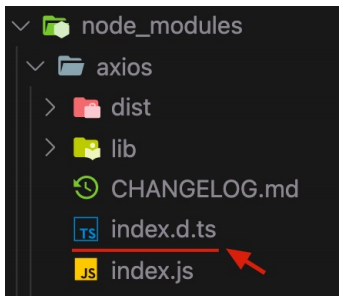

## 概述

今天几乎所有的 JavaScript 应用都会引入许多第三方库来完成任务需求。 

这些第三方库不管是否是用 TS 编写的，最终都要编译成 JS 代码，才能发布给开发者使用。 

我们知道是 TS 提供了类型，才有了代码提示和类型保护等机制。 

但在项目开发中使用第三方库时，你会发现它们几乎都有相应的 TS 类型，这些类型是怎么来的呢？类型声明文件 

**类型声明文件：用来为已存在的 JS 库提供类型信息**。 

这样在 TS 项目中使用这些库时，就像用 TS 一样，都会有代码提示、类型保护等机制了。

1. TS 的两种文件类型 

2. 类型声明文件的使用说明

## 5.1 TS 中的两种文件类型

  TS 中有两种文件类型：1 **.ts 文件** 2 .**d.ts 文件**。

- .ts 文件： 
  1. **既包含类型信息又可执行代码**。 
  2. 可以被编译为 .js 文件，然后，执行代码。 
  3. 用途：编写程序代码的地方。 

- .d.ts 文件： 
  1. **只包含类型信息**的类型声明文件。 
  2. **不会生成 .js 文件**，仅用于**提供类型信息**。 
  3. 用途：为 JS 提供类型信息。 

总结：.ts 是 implementation（代码实现文件）；**.d.ts 是 declaration（类型声明文件）**。 

如果要为 JS 库提供类型信息，要使用 .d.ts 文件。

## 5.2 类型声明文件的使用说明

在使用 TS 开发项目时，**类型声明文件**的使用包括以下两种方式： 

1. 使用已有的类型声明文件 

2. 创建自己的类型声明文件 

学习顺序：**先会用**（别人的）**再会写**（自己的）。

### 使用已有的类型声明文件：

#### 1 内置类型声明文件

内置类型声明文件：**TS 为 JS 运行时可用的所有标准化内置 API 都提供了声明文件**。 

比如，在使用数组时，数组所有方法都会有相应的代码提示以及类型信息：

实际上这都是 TS 提供的内置类型声明文件。 

可以通过 Ctrl + 鼠标左键（Mac：option + 鼠标左键）来查看内置类型声明文件内容。 

比如，查看 forEach 方法的类型声明，在 VSCode 中会自动跳转到 lib.es5.d.ts 类型声明文件中。 

当然，像 window、document 等 BOM、DOM API 也都有相应的类型声明（`lib.dom.d.ts`）。

#### 2 第三方库的类型声明文件

**第三方库的类型声明文件**：目前，几乎所有常用的第三方库都有相应的类型声明文件。 

第三方库的类型声明文件有两种存在形式：1 **库自带类型声明文件** 2 由 **DefinitelyTyped** 提供。

1. 库自带类型声明文件：比如，axios。

解释：这种情况下，正常导入该库，**TS 就会自动加载库自己的类型声明文件**，以提供该库的类型声明。

2. 由 DefinitelyTyped 提供。 

[DefinitelyTyped](https://github.com/DefinitelyTyped/DefinitelyTyped/) 是一个 github 仓库，用来提供高质量 TypeScript 类型声明。 

可以通过 `npm/yarn` 来下载该仓库提供的 TS 类型声明包，这些包的名称格式为：`@types/*`。 

比如，`@types/react、@types/lodash` 等。 

说明：在实际项目开发时，如果你使用的第三方库没有自带的声明文件，VSCode 会给出明确的提示。

  提示以及类型信息：  

解释：当安装 `@types/*` 类型声明包后，**TS 也会自动加载该类声明包**，以提供该库的类型声明。 

补充：TS 官方文档提供了一个页面[ (typescriptlang.org)](https://www.typescriptlang.org/dt)，可以来查询 `@types/*` 库。

### 创建自己的类型声明文件

#### 1 项目内共享类型

项目内共享类型：如果**多个 .ts 文件**中都用到同一个类型，此时可以创建 `index .d.ts` 文件提供该类型，**实现类型共享**。

操作步骤： 

1. 创建 index.d.ts 类型声明文件。 

2. 创建需要共享的类型，并**使用 export 导出**（TS 中的类型也可以使用 import/export 实现模块化功能）。 

3. 在需要使用共享类型的 .ts 文件中，通过 import 导入即可（.d.ts 后缀导入时，直接省略）。

#### 2 为已有 JS 文件提供类型声明

为已有 JS 文件提供类型声明：

1. 在将 JS 项目[迁移](https://www.typescriptlang.org/docs/handbook/migrating-from-javascript.html)到 TS 项目时，为了让已有的 .js 文件有类型声明。 

2. 成为库作者，创建库给其他人使用。

注意：**类型声明文件的编写与模块化方式相关**，不同的模块化方式有不同的写法。但由于历史原因，JS 模块化的发展 经历过多种变化（AMD、CommonJS、UMD、ESModule 等），而 TS 支持各种模块化形式的类型声明。这就导致 ，类型声明文件相关内容又多又杂。

说明：TS 项目中也可以使用 .js 文件。 

说明：在导入 .js 文件时，**TS 会自动加载与 .js 同名的 .d.ts 文件**，以提供类型声明。 

`declare` 关键字：用于类型声明，为其他地方（比如，.js 文件）**已存在的变量声明类型，而不是创建一个新的变量**。 

1. 对于 type、interface 等这些明确就是 TS 类型的（只能在 TS 中使用的），可以省略 declare 关键字。 

2. 对于 let、function 等具有双重含义（在 JS、TS 中都能用），应该使用 declare 关键字，明确指定此处用于类型声明。

