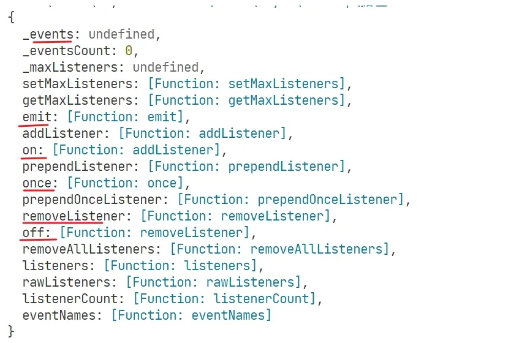
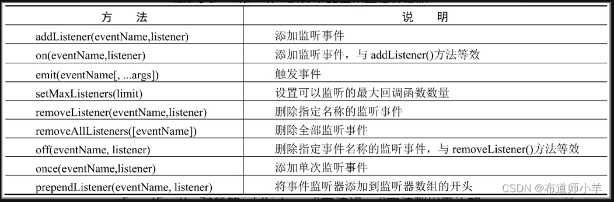

## 前言

本文会介绍 events 模块的主要作用和使用方式，以及自己实现一个简单的[发布订阅模式](https://so.csdn.net/so/search?q=发布订阅模式&spm=1001.2101.3001.7020)，帮助加深理解。

## events 模块

`Node.js` 是基于事件驱动实现的异步操作。 事件驱动依赖就是的 events 模块。

`events` 模块导出一个 `EventEmitter` 类，它是发布订阅模式的一种实现。

无论你是了解发布订阅模式，只要你有过前端开发的经验，那么对于 DOM事件监听，事件解绑等操作一定不陌生。其实这就是一种发布订阅。

平时开发中我们很少会直接使用这个模块。这是因为 `Node.js` 的很多内置模块，比如 `fs` ， `http` 等模块，都是继承自 `EventEmitter` 类而实现的。

也就是说，我们平时经常用到的模块，就已经具备了发布订阅（事件监听、事件触发）的能力。后面会介绍到 `Stream` 和 `http` 模块的使用，到时候就会发现，到处都有发布订阅的影子。

## EventEmitter 类

`events` 模块对外暴露 **`EventEmitter`** 类。

### 原型

打印一下它的原型对象：

```javascript
const EventEmitter = require('events')

console.log(EventEmitter.prototype)

```



有很多方法，光看名字我们就能知道每个方法的作用是什么：



### 使用

`EventEmitter` 类的使用方式有两种。

首先它是一个构造函数（源码中以构造函数实现），所以可以通过实例化的方法来使用。

其次，node 的很多模块都是继承自它，所以子类除了自身的能力之外，也具备了发布订阅的能力。

这里演示下第二种。

```javascript
const EventEmitter = require('events')


class Reader extends EventEmitter {
  // ... 
}

const reader = new Reader()

const buy = bookName => {
  console.log('买新书：', bookName)
}

// 订阅小册上新的事件；当有上新后，就买买买
reader.on('new', buy)

// 小册上新了
reader.emit('new', '《TypeScript 全面进阶指南》') // 买新书： 《TypeScript 全面进阶指南》
// 小册又上新了
reader.emit('new', '《NestJS 项目实战》') // 买新书： 《《NestJS 项目实战》》

// 最近不打算买书了: 取消订阅
reader.off('new', buy)

// 小册上新了。但是取消了订阅，所以消息不会发给你了
reader.emit('new', 'React 上天入地》') // 没有效果

```

### 自己实现发布订阅

实现发布订阅，也是常考的一道面试题。

实现起来也并不复杂，结合注释很方便理解。

```javascript
// 定义一个构造函数
function EventEmitter() {
  //  存储订阅者，也就是事件处理函数的容器。
  // 数据结构为：{ event_type1: [handler1, ...], ... }
  this._events = Object.create(null) // 
}

// 订阅事件的方法
EventEmitter.prototype.on = function on(type, handler) {
  // 首先判断要注册的事件对应的容器是否存在，若存在则将新的 handler 存入，否则先创建一个对应的容器
  let events = this._events[type]
  if (!events) {
    events = this._events[type] = []
  }

  events.push(handler)
}

// 只订阅一次事件的方法
// 思路：利用切片编程的思想，给原始 handler 包装一层。
// 正常的执行逻辑：handler 执行
// 切片编程的逻辑：handler 执行，执行完再调用一次 off 。相当于扩展了 handler 方法
EventEmitter.prototype.once = function on(type, handler) {
  const fn = (...args) => {
    handler(...args)
    this.off(type, fn)
  }

  this.on(type, fn)
}

// 发布事件的方法
EventEmitter.prototype.emit = function emit(type, ...args) {
  // 从事件容器中取出对应的 handler 依次去执行
  // 若发布的事件不存在，则不进行处理
  let events = this._events[type]
  // events可能存在空数组的情况，需要处理
  if (!events || events.length === 0) {
    return
  }
  events.forEach(handler => handler(...args))
}


// 移除事件监听
EventEmitter.prototype.off = function off(type, handler) {
  let events = this._events[type]
  if (!events || events.length === 0) {
    return
  }

  // 过滤掉容器中需要解除监听的方法
  this._events[type] = events.filter(item => handler !== item)
}

// 测试
const emitter = new EventEmitter()

const play = (...args) => {
  console.log('play', ...args)
}

const sing = (...args) => {
  console.log('sing', ...args)
}

emitter.on('play', play)
emitter.on('sing', sing)


emitter.emit('sing', 'rap')  // sing rap
emitter.emit('play', '篮球')  // play 篮球

emitter.off('play', play)
emitter.emit('play')


const dance = () => {
  console.log('dance')
}

emitter.once('dance', dance)

emitter.emit('dance') // dance
emitter.emit('dance') // 已移除订阅，不执行

```

## 延申阅读：eventbus 和 mitt

有一道经典的面试题：Vue 组件通信的方式有哪些？

除了常见的通过属性，自定义事件，借助状态库，在 Vue2 中还有一种方式，叫作 eventBus 事件总线。

EventBus 本质上就是一个发布订阅模式。但是在 Vue3 中被移除了，官方推荐使用一个第三方库 mitt 来做发布订阅。

Mitt是一个十分小巧的发布订阅库，大约只有200字节左右。而且用法上也没有什么太大的差异，稍微看一下文档就会用了。

```javascript
import mitt from 'mitt'

const emitter = mitt()

// 订阅事件
emitter.on('foo', e => console.log('foo', e) )

// 订阅所有的事件
emitter.on('*', (type, e) => console.log(type, e) )

// 触发事件
emitter.emit('foo', { a: 'b' })

// 清除所有的订阅者
emitter.all.clear()

// 使用事件处理函数的引用，方便移除监听 
function onFoo() {}
emitter.on('foo', onFoo)   // listen
emitter.off('foo', onFoo)  // unlisten

```

## 总结

本文介绍了 `Node.js` 中 `events` 模块的使用，它主要导出一个 `EventEmitter` 类来做发布订阅。`Node.js` 的很多核心模块都继承自 `EventEmitter` 类。

它是一个底层的模块，但通常很少直接使用它。等后面讲到 `Stream`，再后面讲到 `http` 模块的时候，就能体会到它的存在了。

额外提一嘴，手写实现，并不是要重复造轮子，主要是为了加深对原生方法的理解。

当然，如果有一个非常巧妙的设计和实现，那早晚也会大火的。

[详解node.js中的EventEmitter相关知识有哪些-群英 (qycn.com)](https://www.qycn.com/xzx/article/14049.html)
