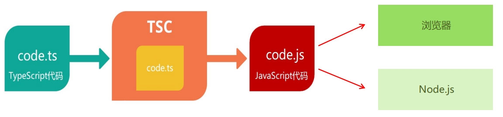

## 安装编译 TS 的工具包

问题：为什么要安装编译 TS 的工具包？

回答：Node.js/浏览器，只认识 JS 代码，不认识 TS 代码。需要先将 TS 代码转化为 JS 代码，然后才能运行。

安装命令：`npm i -g typescript`。

typescript 包：用来编译 TS 代码的包，提供了 tsc 命令，实现了 TS -> JS 的转化。

验证是否安装成功：`tsc –v`（查看 typescript 的版本）。

## 编译并运行 TS 代码

1. 创建 hello.ts 文件（注意：TS 文件的后缀名为 .ts）。

2. 将 TS 编译为 JS：在终端中输入命令，`tsc hello.ts`（此时，在同级目录中会出现一个同名的 JS 文件）。

3. 执行 JS 代码：在终端中输入命令，`node hello.js`。

说明：所有合法的 JS 代码都是 TS 代码，有 JS 基础只需要学习 TS 的类型即可。

注意：由 TS 编译生成的** JS 文件**，代码中就没有**类型信息**了。

## 简化运行 TS 的步骤

问题描述：每次修改代码后，都要重复执行两个命令，才能运行 TS 代码，太繁琐。

简化方式：使用 **ts-node** 包，直接在 Node.js 中执行 TS 代码。

安装命令：`npm i -g ts-node`（ts-node 包提供了 ts-node 命令）。

使用方式：`ts-node hello.ts`。

解释：ts-node 命令在内部偷偷的将 `TS -> JS`，然后，再运行 JS 代码。

