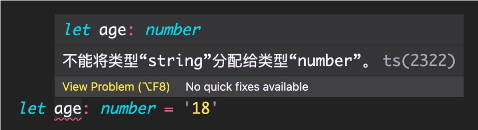
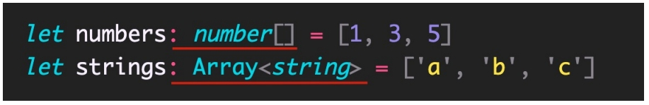
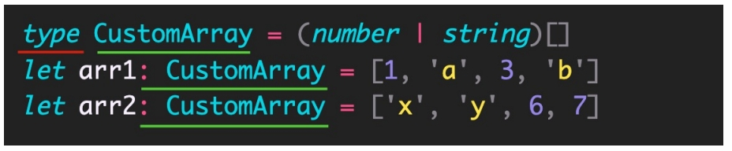

## 概述

TypeScript 是 JS 的超集，TS 提供了 JS 的所有功能，并且额外的增加了：**类型系统**。

- 所有的 JS 代码都是 TS 代码。

- JS 有类型（比如，number/string 等），但是 **JS 不会检查变量的类型是否发生变化**。而 **TS 会检查**。

TypeScript 类型系统的主要优势：可以**显示标记出代码中的意外行为**，从而降低了发生错误的可能性。

1. 类型注解

2. 常用基础类型

## 3.1 类型注解

示例代码：

说明：代码中的 : **number** 就是类型注解。

作用：为变量**添加类型约束**。比如，上述代码中，约定变量 age 的类型为 number（数值类型）。

解释：**约定了什么类型，就只能给变量赋值该类型的值**，否则，就会报错。

## 3.2 常用基础类型概述

可以将 TS 中的常用基础类型细分为两类：1 JS 已有类型 2 TS 新增类型。

1. JS 已有类型
    - 原始类型：`number/string/boolean/null/undefined/symbol`。
    - 对象类型：`object`（包括，数组、对象、函数等对象）。

2. TS 新增类型
    - 联合类型、自定义类型（类型别名）、接口、元组、字面量类型、枚举、`void`、`any` 等。

## 3.3 原始类型

原始类型：`number/string/boolean/null/undefined/symbol`。

特点：**简单**。这些类型，完全按照 JS 中类型的名称来书写。

## 3.4 数组类型

对象类型：object（包括，数组、对象、函数等对象）。

特点：对象类型，在 TS 中更加细化，**每个具体的对象都有自己的类型语法**。

**数组类型**的两种写法：（推荐使用 `number[]` 写法）

需求：数组中既有 `number` 类型，又有 `string` 类型，这个数组的类型应该如何写？

解释：`|` （竖线）在 TS 中叫做联合类型（由两个或多个其他类型组成的类型，表示可以是这些类型中的任意一种）。

注意：这是 TS 中联合类型的语法，只有一根竖线，不要与 JS 中的或（`||`）混淆了。

## 3.5 类型别名

**类型别名**（自定义类型）：为任意类型起别名。

使用场景：当同一类型（复杂）被多次使用时，可以通过类型别名，**简化该类型的使用**。

解释：

1. 使用 **type** 关键字来创建类型别名。

2. 类型别名（比如，此处的 CustomArray），可以是任意合法的变量名称。

3. 创建类型别名后，直接**使用该类型别名作为变量的类型注解**即可。

## 3.6 函数类型

