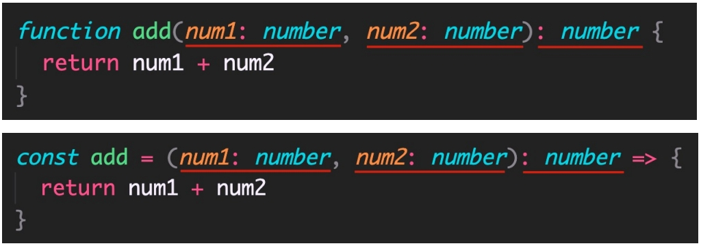

## 概述

TypeScript 是 JS 的超集，TS 提供了 JS 的所有功能，并且额外的增加了：**类型系统**。

- 所有的 JS 代码都是 TS 代码。

- JS 有类型（比如，number/string 等），但是 **JS 不会检查变量的类型是否发生变化**。而 **TS 会检查**。

TypeScript 类型系统的主要优势：可以**显示标记出代码中的意外行为**，从而降低了发生错误的可能性。

1. 类型注解

2. 常用基础类型

## 3.1 类型注解

示例代码：


说明：代码中的 : **number** 就是类型注解。

作用：为变量**添加类型约束**。比如，上述代码中，约定变量 age 的类型为 number（数值类型）。

解释：**约定了什么类型，就只能给变量赋值该类型的值**，否则，就会报错。


## 3.2 常用基础类型概述

可以将 TS 中的常用基础类型细分为两类：1 JS 已有类型 2 TS 新增类型。

1. JS 已有类型
    - 原始类型：`number/string/boolean/null/undefined/symbol`。
    - 对象类型：`object`（包括，数组、对象、函数等对象）。

2. TS 新增类型
    - 联合类型、自定义类型（类型别名）、接口、元组、字面量类型、枚举、`void`、`any` 等。

## 3.3 原始类型

原始类型：`number/string/boolean/null/undefined/symbol`。

特点：**简单**。这些类型，完全按照 JS 中类型的名称来书写。


## 3.4 数组类型

对象类型：object（包括，数组、对象、函数等对象）。

特点：对象类型，在 TS 中更加细化，**每个具体的对象都有自己的类型语法**。

**数组类型**的两种写法：（推荐使用 `number[]` 写法）


需求：数组中既有 `number` 类型，又有 `string` 类型，这个数组的类型应该如何写？


解释：`|` （竖线）在 TS 中叫做联合类型（由两个或多个其他类型组成的类型，表示可以是这些类型中的任意一种）。

注意：这是 TS 中联合类型的语法，只有一根竖线，不要与 JS 中的或（`||`）混淆了。

## 3.5 类型别名

**类型别名**（自定义类型）：为任意类型起别名。

使用场景：当同一类型（复杂）被多次使用时，可以通过类型别名，**简化该类型的使用**。


解释：

1. 使用 **type** 关键字来创建类型别名。

2. 类型别名（比如，此处的 CustomArray），可以是任意合法的变量名称。

3. 创建类型别名后，直接**使用该类型别名作为变量的类型注解**即可。

## 3.6 函数类型

函数的类型实际上指的是：函数**参数**和**返回值**的类型。

为函数指定类型的两种方式：1 单独指定参数、返回值的类型 2 同时指定参数、返回值的类型。

1. 单独指定参数、返回值的类型：



2. 同时指定参数、返回值的类型：


解释：当函数作为表达式时，可以通过**类似箭头函数形式的语法**来为函数添加类型。

注意：这种形式只适用于函数表达式。

3. 如果函数没有返回值，那么，函数返回值类型为：**void**。


4. 可选参数

使用函数实现某个功能时，参数可以传也可以不传。这种情况下，在给函数参数指定类型时，就用到可选参数了。

比如，数组的 slice 方法，可以 slice() 也可以 slice(1) 还可以 slice(1, 3)。


可选参数：在可传可不传的参数名称后面添加 ?（问号）。

注意：**可选参数只能出现在参数列表的最后**，也就是说可选参数后面不能再出现必选参数。

## 3.7 对象类型

JS 中的对象是由属性和方法构成的，而 TS 中**对象的类型**就是在**描述对象的结构**（有什么类型的属性和方法）。

对象类型的写法：


解释：

1. 直接使用 {} 来描述对象结构。属性采用属性名: 类型的形式；方法采用方法名(): 返回值类型的形式。
2. 如果方法有参数，就在方法名后面的小括号中指定参数类型（比如：greet(name: string): void）。
3. 在一行代码中指定对象的多个属性类型时，使用 ;（分号）来分隔。
    - 如果一行代码只指定一个属性类型（通过换行来分隔多个属性类型），可以去掉 ;（分号）。
    - 方法的类型也可以使用箭头函数形式（比如：{ sayHi: () => void }）。

----------

对象的属性或方法，也可以是可选的，此时就用到**可选属性**了。

比如，我们在使用 axios({ … }) 时，如果发送 GET 请求，method 属性就可以省略。


**可选属性**的语法与函数可选参数的语法一致，都使用 **?**（问号）来表示。

## 3.8 接口

当一个对象类型被多次使用时，一般会使用**接口（interface）**来描述对象的类型，达到复用的目的。


解释：

1. 使用 interface 关键字来声明接口。
2. 接口名称（比如，此处的 IPerson），可以是任意合法的变量名称。
3. 声明接口后，直接使用接口名称作为变量的类型。
4. 因为每一行只有一个属性类型，因此，属性类型后没有 ;（分号）。

----------

interface（接口）和 type（类型别名）的对比：


- 相同点：
    - 都可以给对象指定类型。
- 不同点：
    - 接口，只能为对象指定类型。
    - 类型别名，不仅可以为对象指定类型，实际上可以为任意类型指定别名。

----------

如果两个接口之间有相同的属性或方法，可以**将公共的属性或方法抽离出来，通过继承来实现复用**。

比如，这两个接口都有 x、y 两个属性，重复写两次，可以，但很繁琐。


更好的方式：


解释：

1. 使用 extends（继承）关键字实现了接口 Point3D 继承 Point2D。
2. 继承后，Point3D 就有了 Point2D 的所有属性和方法（此时，Point3D 同时有 x、y、z 三个属性）。

## 3.9 元组

场景：在地图中，使用经纬度坐标来标记位置信息。

可以使用数组来记录坐标，那么，该数组中只有两个元素，并且这两个元素都是数值类型。


使用 `number[]` 的缺点：不严谨，因为该类型的数组中可以出现任意多个数字。

更好的方式：**元组（Tuple）**。

元组类型是另一种类型的数组，它**确切地知道包含多少个元素，以及特定索引对应的类型**。


解释：

1. 元组类型可以确切地标记出有多少个元素，以及每个元素的类型。
2. 该示例中，元素有两个元素，每个元素的类型都是 number。

## 3.10 类型推论

在 TS 中，某些没有明确指出类型的地方，TS 的**类型推论机制会帮助提供类型**。

换句话说：由于类型推论的存在，这些地方，类型注解可以**省略**不写！

发生类型推论的 2 种常见场景：1 声明变量并初始化时 2 决定函数返回值时。


注意：这两种情况下，类型注解可以省略不写！

推荐：**能省略类型注解的地方就省略**（~~偷懒~~，充分利用TS类型推论的能力，提升开发效率）。

技巧：如果不知道类型，可以通过鼠标放在变量名称上，利用 VSCode 的提示来查看类型。

## 3.11 类型断言

有时候你会比 TS 更加明确一个值的类型，此时，可以使用类型断言来指定更具体的类型。

比如，


注意：`getElementById` 方法返回值的类型是 HTMLElement，该类型只包含所有标签公共的属性或方法，不包含 a 标签特有的 href 等属性。

因此，这个类型**太宽泛（不具体）**，无法操作 href 等 a 标签特有的属性或方法。

解决方式：这种情况下就需要**使用类型断言指定更加具体的类型**。

------------------

使用类型断言：


解释：

1. 使用 as 关键字实现类型断言。
2. 关键字 as 后面的类型是一个更加具体的类型（HTMLAnchorElement 是 HTMLElement 的子类型）。
3. 通过类型断言，aLink 的类型变得更加具体，这样就可以访问 a 标签特有的属性或方法了。

-------------------

另一种语法，使用 <> 语法，这种语法形式不常用知道即可：


技巧：在浏览器控制台，通过 console.dir() 打印 DOM 元素，在属性列表的最后面，即可看到该元素的类型。

## 3.12 字面量类型

思考以下代码，两个变量的类型分别是什么？


通过 TS 类型推论机制，可以得到答案：

1. 变量 str1 的类型为：**string**。
2. 变量 str2 的类型为：**'Hello TS'**。

解释：

1. str1 是一个变量（let），它的值可以是任意字符串，所以类型为：**string**。
2. str2 是一个常量（const），它的值不能变化只能是 **'Hello TS'**，所以，它的类型为：**'Hello TS'**。

注意：此处的 **'Hello TS'**，就是一个**字面量类型**。也就是说**某个特定的字符串也可以作为 TS 中的类型**。

除字符串外，任意的 JS 字面量（比如，对象、数字等）都可以作为类型使用。

---------------------

使用模式：**字面量类型配合联合类型一起使用**。

使用场景：用来**表示一组明确的可选值列表**。

比如，在贪吃蛇游戏中，游戏的方向的可选值只能是上、下、左、右中的任意一个。


解释：参数 direction 的值只能是 up/down/left/right 中的任意一个。

优势：相比于 string 类型，使用字面量类型更加精确、严谨。

## 3.13 枚举

枚举的功能类似于**字面量类型+联合类型**组合的功能，也可以表示**一组明确的可选值**。

**枚举：定义一组命名常量**。它描述一个值，该值可以是这些命名常量中的一个。


解释：

1. 使用 `enum` 关键字定义枚举。
2. 约定枚举名称、枚举中的值以大写字母开头。
3. 枚举中的多个值之间通过 ,（逗号）分隔。
4. 定义好枚举后，直接使用枚举名称作为类型注解。

------------------

注意：形参 direction 的**类型为枚举 Direction**，那么，实参的**值就应该是枚举 Direction 成员的任意一个**。

访问枚举成员：


解释：类似于 JS 中的对象，直接通过**点（.）语法访问**枚举的成员。

-------------------

问题：我们把枚举成员作为了函数的实参，它的值是什么呢？


解释：通过将鼠标移入 `Direction.Up`，可以看到枚举成员 Up 的值为 0。

注意：**枚举成员是有值的**，默认为：**从 0 开始自增的数值**。

我们把，枚举成员的值为数字的枚举，称为：**数字枚举**。

当然，也可以给枚举中的成员初始化值。


----------------

**字符串枚举**：枚举成员的值是字符串。

```typescript
enum Direction {
    Up = 'UP',
    Down = 'DOWN',
    Left = 'LEFT',
    Right = 'RIGHT',
}
```

注意：字符串枚举没有自增长行为，因此，**字符串枚举的每个成员必须有初始值**。

---------------------

枚举是 TS 为数不多的非 JavaScript 类型级扩展（不仅仅是类型）的特性之一。

因为：其他类型仅仅被当做类型，而**枚举不仅用作类型，还提供值**（枚举成员都是有值的）。

也就是说，其他的类型会在编译为 JS 代码时自动移除。但是，**枚举类型会被编译为 JS 代码**！


说明：枚举与前面讲到的字面量类型+联合类型组合的功能类似，都用来表示一组明确的可选值列表。

一般情况下，推荐使用**字面量类型+联合类型组合**的方式，因为相比枚举，这种方式更加直观、简洁、高效。

## 3.14 any 类型

**原则：不推荐使用 any！**这会让 TypeScript 变为 “AnyScript”（失去 TS 类型保护的优势）。

因为当值的类型为 any 时，可以对该值进行任意操作，并且不会有代码提示。


解释：以上操作都不会有任何类型错误提示，即使可能存在错误！

尽可能的避免使用 any 类型，除非**临时使用 any** 来“避免”书写很长、很复杂的类型！

其他隐式具有 any 类型的情况：1 声明变量不提供类型也不提供默认值 2 函数参数不加类型。

注意：因为不推荐使用 any，所以，这两种情况下都应该提供类型！

## 3.15 typeof

众所周知，JS 中提供了 `typeof` 操作符，用来在 JS 中获取数据的类型。

```typescript
console.log(typeof "HelloWorld")    //打印string
```

实际上，TS 也提供了 `typeof` 操作符：可以在**类型上下文中**引用变量或属性的类型（类型查询）。

使用场景：根据已有变量的值，获取该值的类型，来简化类型书写。


解释：

1. 使用 `typeof` 操作符来获取变量 p 的类型，结果与第一种（对象字面量形式的类型）相同。
2. `typeof` 出现在**类型注解的位置**（参数名称的冒号后面）所处的环境就在**类型上下文**（区别于 JS 代码）。
3. 注意：`typeof` 只能用来查询变量或属性的类型，无法查询其他形式的类型（比如，函数调用的类型）。


