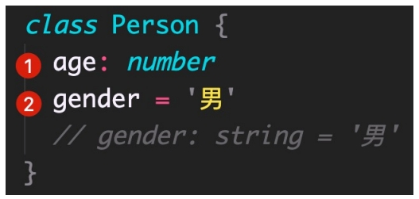
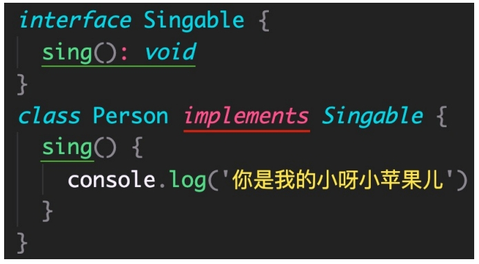

## 概述

TS 中的高级类型有很多，重点学习以下高级类型：

1. class 类

2. 类型兼容性

3. 交叉类型

4. 泛型 和 keyof

5. 索引签名类型 和 索引查询类型

6. 映射类型

## 4.1 class 类

TypeScript 全面支持 ES2015 中引入的 **class** 关键字，并为其添加了类型注解和其他语法（比如，可见性修饰符等）

解释：

1. 根据 TS 中的类型推论，可以知道 Person 类的实例对象 p 的类型是 Person。
2. TS 中的 class，不仅提供了 **class 的语法功能，也作为一种类型存在**。

-----------------

实例属性初始化：

解释：

1. 声明成员 age，类型为 number（没有初始值）。
2. 声明成员 gender，并设置初始值，此时，可省略类型注解（TS **类型推论** 为 string 类型）。

--------------------

构造函数：

解释：

1. 成员初始化（比如，age: number）后，才可以通过 this.age 来访问实例成员。
2. 需要为构造函数指定类型注解，否则会被隐式推断为 any；构造函数不需要返回值类型。

-----------------------

实例方法：

解释：方法的类型注解（参数和返回值）与函数用法相同。

------------------------

类继承的两种方式：1 **extends**（继承父类） 2 implements（实现接口）。

说明：JS 中只有 extends，而 implements 是 TS 提供的。

解释：

1. 通过 **extends** 关键字实现**继承**。
2. 子类 Dog 继承父类 Animal，则 Dog 的实例对象 dog 就同时具有了父类 Animal 和 子类 Dog 的所有属性和方法。

-----------------------------

类继承的两种方式：1 extends（继承父类） 2 **implements**（实现接口）。

解释：

1. 通过 **implements** 关键字让 class 实现接口。
2. Person 类实现接口 Singable 意味着，Person 类中必须提供 Singable 接口中指定的所有方法和属性。

-----------------------

类成员可见性：可以使用 TS 来**控制 class 的方法或属性对于 class 外的代码是否可见**。
可见性修饰符包括：1 **public（公有的）** 2 protected（受保护的） 3 private（私有的）。

1. public：表示公有的、公开的，**公有成员可以被任何地方访问**，默认可见性。

解释：

1. 在类属性或方法前面添加 **public** 关键字，来修饰该属性或方法是共有的。
2. 因为 public 是默认可见性，所以，可以**直接省略**。

---------------------------------

2. **protected**：表示**受保护的**，仅对其声明所在类和子类中（非实例对象）可见。

解释：

1. 在类属性或方法前面添加 **protected** 关键字，来修饰该属性或方法是受保护的。
2. 在子类的方法内部可以通过 this 来访问父类中受保护的成员，但是，**对实例不可见**！

-------------------------

3. **private**：表示私有的，只在当前类中可见，对实例对象以及子类也是不可见的。

解释：

1. 在类属性或方法前面添加 **private** 关键字，来修饰该属性或方法是私有的。
2. 私有的属性或方法只在当前类中可见，对子类和实例对象也都是不可见的！

-------------------

除了可见性修饰符之外，还有一个常见修饰符就是：**readonly（只读修饰符）**。

**readonly**：表示**只读，用来防止在构造函数之外对属性进行赋值**。

解释：

1. 使用 **readonly** 关键字修饰该属性是只读的，注意**只能修饰属性不能修饰方法**。
2. 注意：属性 age 后面的类型注解（比如，此处的 number）如果不加，则 age 的类型为 18 （**字面量类型**）。
3. **接口或者 {} 表示的对象类型，也可以使用 readonly**。

## 4.2 类型兼容性

