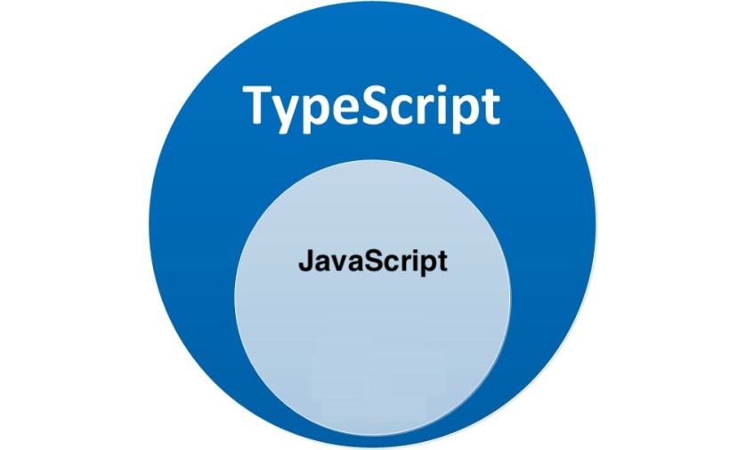

## TypeScript 是什么

**TypeScript**（简称：TS）是 JavaScript 的**超集**（JS 有的 TS 都有）。

TypeScript = **Type** + JavaScript（在 JS 基础之上，为 JS 添加了**类型支持**）。

TypeScript 是微软开发的开源编程语言，可以在任何运行 JavaScript 的地方运行。

## TypeScript 为什么要为 JS 添加类型支持？

背景：JS 的类型系统存在“先天缺陷”，JS 代码中绝大部分错误都是**类型**错误（Uncaught **Type**Error）。

问题：增加了找 Bug、改 Bug 的时间，严重影响开发效率。

从编程语言的动静来区分，TypeScript 属于静态类型的编程语言，JS 属于动态类型的编程语言。

静态类型：编译期做类型检查； 动态类型：执行期做类型检查。

代码编译和代码执行的顺序：1 编译 2 执行。

对于 JS 来说：需要等到代码真正去**执行**的时候才能发现**错误**（晚）。

对于 TS 来说：在代码**编译**的时候（代码执行前）就可以**发现错误**（早）。

并且，配合 VSCode 等开发工具，TS 可以**提前到在编写代码的同时**就发现代码中的错误，**减少找 Bug、改 Bug 时间**。

## TypeScript 相比 JS 的优势

1. 更早（写代码的同时）发现错误，**减少找 Bug、改 Bug 时间**，提升开发效率。

2. 程序中任何位置的代码都有**代码提示**，随时随地的安全感，增强了开发体验。

3. 强大的**类型系统**提升了代码的可维护性，使得**重构代码更加容易**。

4. 支持**最新的 ECMAScript 语法**，优先体验最新的语法，让你走在前端技术的最前沿。

5. TS **类型推断**机制，**不需要**在代码中的**每个地方都显示标注类型**，让你在享受优势的同时，尽量降低了成本。

除此之外，Vue 3 源码使用 TS 重写、Angular 默认支持 TS、React 与 TS 完美配合，TypeScript 已成为大中型前端
项目的首先编程语言。

