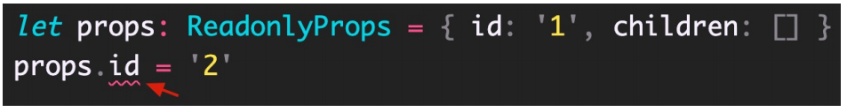
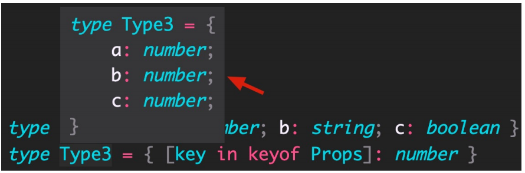

## 概述

TS 中的高级类型有很多，重点学习以下高级类型：

1. class 类

2. 类型兼容性

3. 交叉类型

4. 泛型 和 keyof

5. 索引签名类型 和 索引查询类型

6. 映射类型

## 4.1 class 类

TypeScript 全面支持 ES2015 中引入的 **class** 关键字，并为其添加了类型注解和其他语法（比如，可见性修饰符等）


解释：

1. 根据 TS 中的类型推论，可以知道 Person 类的实例对象 p 的类型是 Person。
2. TS 中的 class，不仅提供了 **class 的语法功能，也作为一种类型存在**。

-----------------

实例属性初始化：


解释：

1. 声明成员 age，类型为 number（没有初始值）。
2. 声明成员 gender，并设置初始值，此时，可省略类型注解（TS **类型推论** 为 string 类型）。

--------------------

构造函数：


解释：

1. 成员初始化（比如，age: number）后，才可以通过 this.age 来访问实例成员。
2. 需要为构造函数指定类型注解，否则会被隐式推断为 any；构造函数不需要返回值类型。

-----------------------

实例方法：


解释：方法的类型注解（参数和返回值）与函数用法相同。

------------------------

类继承的两种方式：1 **extends**（继承父类） 2 implements（实现接口）。

说明：JS 中只有 extends，而 implements 是 TS 提供的。


解释：

1. 通过 **extends** 关键字实现**继承**。
2. 子类 Dog 继承父类 Animal，则 Dog 的实例对象 dog 就同时具有了父类 Animal 和 子类 Dog 的所有属性和方法。

-----------------------------

类继承的两种方式：1 extends（继承父类） 2 **implements**（实现接口）。


解释：

1. 通过 **implements** 关键字让 class 实现接口。
2. Person 类实现接口 Singable 意味着，Person 类中必须提供 Singable 接口中指定的所有方法和属性。

-----------------------

类成员可见性：可以使用 TS 来**控制 class 的方法或属性对于 class 外的代码是否可见**。
可见性修饰符包括：1 **public（公有的）** 2 protected（受保护的） 3 private（私有的）。

1. public：表示公有的、公开的，**公有成员可以被任何地方访问**，默认可见性。


解释：

1. 在类属性或方法前面添加 **public** 关键字，来修饰该属性或方法是共有的。
2. 因为 public 是默认可见性，所以，可以**直接省略**。

---------------------------------

2. **protected**：表示**受保护的**，仅对其声明所在类和子类中（非实例对象）可见。


解释：

1. 在类属性或方法前面添加 **protected** 关键字，来修饰该属性或方法是受保护的。
2. 在子类的方法内部可以通过 this 来访问父类中受保护的成员，但是，**对实例不可见**！

-------------------------

3. **private**：表示私有的，只在当前类中可见，对实例对象以及子类也是不可见的。


解释：

1. 在类属性或方法前面添加 **private** 关键字，来修饰该属性或方法是私有的。
2. 私有的属性或方法只在当前类中可见，对子类和实例对象也都是不可见的！

-------------------

除了可见性修饰符之外，还有一个常见修饰符就是：**readonly（只读修饰符）**。

**readonly**：表示**只读，用来防止在构造函数之外对属性进行赋值**。


解释：

1. 使用 **readonly** 关键字修饰该属性是只读的，注意**只能修饰属性不能修饰方法**。
2. 注意：属性 age 后面的类型注解（比如，此处的 number）如果不加，则 age 的类型为 18 （**字面量类型**）。
3. **接口或者 {} 表示的对象类型，也可以使用 readonly**。


## 4.2 类型兼容性

两种类型系统：1 Structural Type System（结构化类型系统） 2 Nominal Type System（标明类型系统）。 

**TS 采用的是结构化类型系统**，也叫做 duck typing（鸭子类型），**类型检查关注的是值所具有的形状**。 

也就是说，在结构类型系统中，如果两个对象具有相同的形状，则认为它们属于同一类型。


解释： 

1. Point 和 Point2D 是两个名称不同的类。 

2. 变量 p 的类型被显示标注为 Point 类型，但是，它的值却是 Point2D 的实例，并且没有类型错误。 

3. 因为 TS 是结构化类型系统，只检查 Point 和 Point2D 的结构是否相同（相同，都具有 x 和 y 两个属性，属性类型也相同）。 

4. 但是，如果在 Nominal Type System 中（比如，C#、Java 等），它们是不同的类，类型无法兼容。

--------------------------------------------

注意：在结构化类型系统中，如果两个对象具有相同的形状，则认为它们属于同一类型，这种说法并不准确。 

**更准确的说法：对于对象类型来说，y 的成员至少与 x 相同，则 x 兼容 y（成员多的可以赋值给少的）**。


解释：
1. Point3D 的成员**至少**与 Point 相同，则 Point 兼容 Point3D。
2. 所以，成员多的 Point3D 可以赋值给成员少的 Point。

----------------------------------------

除了 class 之外，TS 中的其他类型也存在相互兼容的情况，包括：1 **接口兼容性** 2 函数兼容性 等。

- **接口之间的兼容性，类似于 class**。并且，class 和 interface 之间也可以兼容。


- **函数之间兼容性比较复杂**，需要考虑：1 参数个数 2 参数类型 3 返回值类型。

**参数个数**，参数多的兼容参数少的（或者说，**参数少的可以赋值给多的**）。


解释： 

1. 参数少的可以赋值给参数多的，所以，f1 可以赋值给 f2。 

2. 数组 forEach 方法的第一个参数是回调函数，该示例中类型为：(value: string, index: number, array: string[]) => void。 

3. 在 JS 中省略用不到的函数参数实际上是很常见的，这样的使用方式，促成了 TS 中函数类型之间的兼容性。 

4. 并且因为回调函数是有类型的，所以，TS 会自动推导出参数 item、index、array 的类型。

**参数类型**，相同位置的参数类型要相同（原始类型）或兼容（对象类型）。


解释：函数类型 F2 兼容函数类型 F1，因为 F1 和 F2 的第一个参数类型相同。

**参数类型**，相同位置的参数类型要相同或兼容。


解释： 

1. 注意，此处与前面讲到的接口兼容性冲突。 

2. 技巧：将对象拆开，把每个属性看做一个个参数，则，参数少的（f2）可以赋值给参数多的（f3）。

**返回值类型**，只关注返回值类型本身即可：


解释： 

1. 如果返回值类型是原始类型，此时两个类型要相同，比如，左侧类型 F5 和 F6。 

2. 如果返回值类型是对象类型，此时成员多的可以赋值给成员少的，比如，右侧类型 F7 和 F8。


## 4.3 交叉类型

**交叉类型（&）**：功能类似于接口继承（extends），用于组合多个类型为一个类型（常用于对象类型）。 

比如，


解释：使用交叉类型后，新的类型 PersonDetail 就同时具备了 Person 和 Contact 的所有属性类型。 

相当于，

```typescript
type PersonDetail = {
    name: string,
    phone: string
}
```

------------------------------------

交叉类型（&）和接口继承（extends）的对比： 

- 相同点：都可以实现对象类型的组合。 

- 不同点：两种方式实现类型组合时，对于同名属性之间，**处理类型冲突的方式不同**。


说明：以上代码，接口继承会报错（类型不兼容）；交叉类型没有错误，可以简单的理解为：

```typescript
fn: (value: string | number) => string
```


## 4.4 泛型

**泛型**是可以在**保证类型安全**前提下，让函数等**与多种类型一起工作**，从而**实现复用**，常用于：函数、接口、class 中。 

需求：创建一个 id 函数，传入什么数据就返回该数据本身（也就是说，参数和返回值类型相同）。

```typescript
function id(value: number): number { return value }
```

比如，id(10) 调用以上函数就会直接返回 10 本身。但是，该函数只接收数值类型，无法用于其他类型。 

为了能让函数能够接受任意类型，可以将参数类型修改为 any。但是，这样就失去了 TS 的类型保护，类型不安全。

```typescript
function id(value: any): any { return value }
```

**泛型**在**保证类型安全**（不丢失类型信息）的同时，可以让函数等与多种不同的类型一起工作，灵活可复用。 

实际上，在 C＃和 Java 等编程语言中，泛型都是用来实现可复用组件功能的主要工具之一。

--------------------------------------------------------

创建泛型函数：

```typescript
function id<Type>(value: Type): Type {
    return value
}
```

解释： 

1. 语法：在函数名称的后面添加 <>（尖括号），**尖括号中添加类型变量**，比如此处的 Type。 

2. **类型变量 Type，是一种特殊类型的变量，它处理类型而不是值**。 

3. 该类型变量相当于一个类型容器，能够捕获用户提供的类型（具体是什么类型由用户调用该函数时指定）。 

4. 因为 Type 是类型，因此可以将其作为函数参数和返回值的类型，表示参数和返回值具有相同的类型。 

5. 类型变量 Type，可以是任意合法的变量名称。

-----------------------------------

调用泛型函数：

```typescript
const num1 = id<number>(10)
const num2 = id<string>('a')
```

解释： 

1. 语法：在函数名称的后面添加 <>（尖括号），**尖括号中指定具体的类型**，比如，此处的 number。 
2. 当传入类型 number 后，这个类型就会被函数声明时指定的类型变量 Type 捕获到。 
3. 此时，Type 的类型就是 number，所以，函数 id 参数和返回值的类型也都是 number。

同样，如果传入类型 string，函数 id 参数和返回值的类型就都是 string。 

这样，通过泛型就做到了让 id 函数与多种不同的类型一起工作，**实现了复用的同时保证了类型安全**。

------------------------------------------

简化调用泛型函数： 


解释： 

1. 在调用泛型函数时，**可以省略 <类型> 来简化泛型函数的调用**。 

2. 此时，TS 内部会采用一种叫做**类型参数推断**的机制，来根据传入的实参自动推断出类型变量 Type 的类型。 

3. 比如，传入实参 10，TS 会自动推断出变量 num 的类型 number，并作为 Type 的类型。 

推荐：使用这种简化的方式调用泛型函数，使代码更短，更易于阅读。 

说明：当编译器无法推断类型或者推断的类型不准确时，就需要显式地传入类型参数。

----------------------------------------

泛型约束：默认情况下，泛型函数的类型变量 Type 可以代表多个类型，这导致无法访问任何属性。 

比如，id('a') 调用函数时获取参数的长度：


解释：Type 可以代表任意类型，无法保证一定存在 length 属性，比如 number 类型就没有 length。 

此时，就需要为泛型**添加约束来收缩类型**（缩窄类型取值范围）。

-----------------------------------------

添加泛型约束收缩类型，主要有以下两种方式：1 指定更加具体的类型 2 添加约束。

1. 指定更加具体的类型

```typescript
function id<Type>(value: Type[]): Type[] {
    console.log(value.length)
    return value
}
```

比如，将类型修改为 Type[]（Type 类型的数组），因为只要是数组就一定存在 length 属性，因此就可以访问了。

2. 添加约束

```typescript
interface ILength {
    length: number
}
function id<Type extends Ilength>(value: Type): Type {
    console.log(value.length)
    return value
}
```

解释： 

1. 创建描述约束的接口 ILength，该接口要求提供 length 属性。 

2. 通过 **extends** 关键字使用该接口，为泛型（类型变量）添加约束。 

3. 该约束表示：**传入的类型必须具有 length 属性**。

注意：传入的实参（比如，数组）只要有 length 属性即可，这也符合前面讲到的接口的类型兼容性。

-----------------------------------

泛型的类型变量可以有多个，并且**类型变量之间还可以约束**（比如，第二个类型变量受第一个类型变量约束）。 

比如，创建一个函数来获取对象中属性的值：


解释： 

1. 添加了第二个类型变量 Key，两个类型变量之间使用（,）**逗号**分隔。 

2. **keyof** 关键字**接收一个对象类型，生成其键名称（可能是字符串或数字）的联合类型**。 

3. 本示例中 **keyof Type** 实际上获取的是 person 对象**所有键的联合类型**，也就是：'name' | 'age'。 

4. 类型变量 Key 受 Type 约束，可以理解为：Key 只能是 Type 所有键中的任意一个，或者说只能访问对象中存在的属性。

-------------------------------

**泛型接口**：接口也可以配合泛型来使用，以增加其灵活性，增强其复用性

```typescript
interface IdFunc<Type> {
    id: (value: Type) => Type
    ids: () => Type[]
}
let obj: IdFunc<number> = {
    id(value) {
        return value
    },
    ids() {
        return [1,3,5]
	}
}
```

解释： 

1. 在接口名称的后面添加 **<类型变量>**，那么，这个接口就变成了泛型接口。 

2. 接口的类型变量，对接口中所有其他成员可见，也就是**接口中所有成员都可以使用类型变量**。 

3. 使用泛型接口时，**需要显式指定具体的类型**（比如，此处的 `IdFunc<nunber>`）。 

4. 此时，id 方法的参数和返回值类型都是 number；ids 方法的返回值类型是 `number[]`。

----------------------------------

实际上，JS 中的数组在 TS 中就是一个**泛型接口**。


解释：当我们在使用数组时，TS 会根据数组的不同类型，来自动将类型变量设置为相应的类型。 

技巧：可以通过 Ctrl + 鼠标左键（Mac：option + 鼠标左键）来查看具体的类型信息。

--------------------------------

**泛型类**：class 也可以配合泛型来使用。 

比如，React 的 class 组件的基类 Component 就是泛型类，不同的组件有不同的 props 和 state。


解释：React.Component 泛型类两个类型变量，分别指定 props 和 state 类型。

--------------------------------------

创建泛型类：

```typescript
clsss GenericNumber<NumType> {
    defaultValue: NumType
    add: (x: NumType, y: NumType) => NumType
}
```

解释： 

1. 类似于泛型接口，在 class 名称后面添加 **<类型变量>**，这个类就变成了泛型类。 

2. 此处的 add 方法，采用的是箭头函数形式的类型书写方式。

```typescript
const myNum = new GenericNumber<number>()
myNum.defaultValue = 10
```

类似于泛型接口，在创建 class 实例时，在类名后面通过 <类型> 来指定明确的类型。

### 泛型工具类

泛型工具类型：TS 内置了一些常用的工具类型，来简化 TS 中的一些常见操作。 

说明：它们都是基于泛型实现的（泛型适用于多种类型，更加通用），并且是内置的，可以直接在代码中使用。 

这些工具类型有很多，主要学习以下几个：

1. `Partial<Type> `

2. `Readonly<Type> `

3. `Pick<Type, Keys> `

4. `Record<Keys, Type>`

#### `Partial<Type>`

泛型工具类型 - `Partial<Type>` 用来构造（创建）一个类型，将 Type 的所有属性设置为可选。

```typescript
interface Props {
    id: string
    children: number[]
}
type PartialProps = Partial<Props>
```

解释：构造出来的新类型 PartialProps 结构和 Props 相同，但所有属性都变为可选的。

#### `Readonly<Type>`

泛型工具类型 - `Readonly<Type>` 用来构造一个类型，将 Type 的所有属性都设置为 readonly

```typescript
interface Props {
    id: string
    children: number[]
}
type ReadonlyProps = Readonly<Props>
```

解释：构造出来的新类型 ReadonlyProps 结构和 Props 相同，但所有属性都变为只读的。



当我们想重新给 id 属性赋值时，就会报错：无法分配到 "id" ，因为它是只读属性。

#### `Pick<Type, Keys>`

泛型工具类型 - `Pick<Type, Keys>` 从 Type 中选择一组属性来构造新类型。

```typescript
interface Props {
    id: string
    title: string
    children: number[]
}
type PickProps = Pick<Props, 'id' | 'title'>
```

解释： 

1. Pick 工具类型有两个类型变量：1 表示选择谁的属性 2 表示选择哪几个属性。 

2. 其中第二个类型变量，如果只选择一个则只传入该属性名即可。 

3. **第二个类型变量传入的属性只能是第一个类型变量中存在的属性**。 

4. 构造出来的新类型 PickProps，只有 id 和 title 两个属性类型。

#### `Record<Keys,Type>`

泛型工具类型 - `Record<Keys,Type>` 构造一个对象类型，属性键为 Keys，属性类型为 Type。

```typescript
type RecordObj = Record<'a' | 'b' | 'c', string[]>
let obj: RecordObj = {
    a: ['1'],
    b: ['1'],
    c: ['1'],
}
```

解释： 

1. Record 工具类型有两个类型变量：**1 表示对象有哪些属性 2 表示对象属性的类型**。 

2. 构建的新对象类型 RecordObj 表示：这个对象有三个属性分别为`a/b/c`，属性值的类型都是 `string[]`。

## 4.5 索引签名类型

绝大多数情况下，我们都可以在使用对象前就确定对象的结构，并为对象添加准确的类型。 

使用场景：**当无法确定对象中有哪些属性**（或者说对象中可以出现任意多个属性），此时，就用到**索引签名类型**了。

```typescript
interface AnyObject {
    [key: string]: number
}
let obj: AnyObject = {
    a: 1,
    b: 1
}
```

解释： 

1. 使用 `[key: string]` 来约束该接口中允许出现的属性名称。表示只要是 string 类型的属性名称，都可以出现在对象中。 

2. 这样，对象 obj 中就可以出现任意多个属性（比如，a、b 等）。 

3. **key 只是一个占位符**，可以换成任意合法的变量名称。 

4. 隐藏的前置知识：**JS 中对象（{}）的键是 string 类型的**。

-------------------------------------

在 JS 中数组是一类特殊的对象，特殊在**数组的键（索引）是数值类型**。

并且，数组也可以出现任意多个元素。所以，在数组对应的泛型接口中，也用到了索引签名类型。

```typescript
interface MyArray<T> {
    [n: number]: T
}
let arr: MyArray<number> = [1,3,5]
```

解释： 

1. MyArray 接口模拟原生的数组接口，并使用 `[n: number]` 来作为索引签名类型。 

2. 该索引签名类型表示：只要是 number 类型的键（索引）都可以出现在数组中，或者说数组中可以有任意多个元素。 

3. 同时也符合数组索引是 number 类型这一前提。

## 4.6 映射类型

**映射类型：基于旧类型创建新类型（对象类型）**，减少重复、提升开发效率。 

比如，类型 PropKeys 有 x/y/z，另一个类型 Type1 中也有 x/y/z，并且 Type1 中 x/y/z 的类型相同：


这样书写没错，但 x/y/z 重复书写了两次。像这种情况，就可以使用映射类型来进行简化。


解释： 

1. 映射类型是**基于索引签名类型**的，所以，该语法类似于索引签名类型，也使用了 []。 

2. `Key in PropKeys` 表示 Key 可以是 PropKeys 联合类型中的任意一个，类似于 `forin(let k in obj)`。 

3. 使用映射类型创建的新对象类型 Type2 和类型 Type1 结构完全相同。 

4. 注意：**映射类型只能在类型别名中使用，不能在接口中使用**

---------------------------------

映射类型除了根据联合类型创建新类型外，还可以根据对象类型来创建：


解释： 

1. 首先，先执行 keyof Props 获取到对象类型 Props 中所有键的联合类型即，`'a' | 'b' | 'c'`。 

2. 然后，`Key in ...` 就表示 Key 可以是 Props 中所有的键名称中的任意一个。



-------------------------------------

实际上，前面讲到的泛型工具类型（比如，`Partial<Type>`）都是基于映射类型实现的。 

比如，`Partial<Type>` 的实现：


解释： 

1. `keyof T` 即 keyof Props 表示获取 Props 的所有键，也就是：`'a' | 'b' | 'c'`。 

2. 在 [] 后面添加 ?（问号），表示将这些属性变为**可选**的，以此来实现 Partial 的功能。 

3. 冒号后面的 `T[P] 表示获取 T 中每个键对应的类型`。比如，如果是 'a' 则类型是 number；如果是 'b' 则类型是 string。 

4. 最终，新类型 PartialProps 和旧类型 Props 结构完全相同，只是让所有类型都变为可选了。

------------------------------------

刚刚用到的 **T[P]** 语法，在 TS 中叫做**索引查询（访问）类型**。 

作用：**用来查询属性的类型**。


解释：`Props['a']` 表示查询类型 Props 中属性 'a' 对应的类型 number。所以，TypeA 的类型为 number。 

注意：**`[]`中的属性必须存在于被查询类型中**，否则就会报错。

--------------------------------------

**索引查询类型**的其他使用方式：同时查询多个索引的类型

```typescript
type Props = {
    a: number,
    b: string,
    c: boolean,
}
type TypeA = Props['a' | 'b']	//string | number
```

解释：使用字符串字面量的联合类型，获取属性 a 和 b 对应的类型，结果为：` string | number`。

```typescript
type TypeA = Props[keyof Props]	//string | number | boolean
```

解释：使用 keyof 操作符获取 Props 中所有键对应的类型，结果为：` string | number | boolean`。


